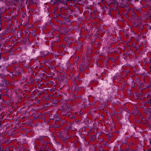
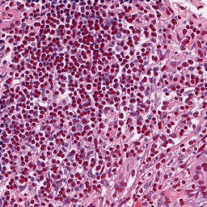

# AI-Based Cell Nuclei Segmentation and Counting in Microscopy Images Using U-Net

**Final Project Report**

---

## 1. Title Page

| Field | Value |
|---|---|
| Project title | AI-Based Cell Nuclei Segmentation and Counting in Microscopy Images Using U-Net |
| Course | ENS 005 – Applications of Artificial Intelligence in Image Processing |
| Submission date | 22 May 2026 |
| Deliverable | Final Project Report |

**Team members**

| # | Name | Student ID |
|---|---|---|
| 1 | Ibrahim Fiteymi | 229912187 |
| 2 | Mohammad Bashli | 2309115076 |
| 3 | Mariam Noureddine | 220903422 |
| 4 | Nibal M. M. Abusalem | 229911755 |

---

## 2. Abstract

Manual counting of cell nuclei in histopathology microscopy images is time-consuming, observer-dependent, and difficult to scale. This project investigates an automated alternative based on deep-learning semantic segmentation. We implement a U-Net model with a ResNet18 encoder using PyTorch and the *segmentation_models_pytorch* library, and apply it to the publicly available MoNuSeg dataset. Annotations originally distributed as XML polygon files were converted into binary masks; 37 image–mask pairs were prepared and partitioned into 29 training, 4 validation, and 4 test images, all resized to 256 × 256.

The trained model achieves an average Dice coefficient of **0.7414** and an average Intersection-over-Union (IoU) of **0.5902** on the validation set. To convert segmentation outputs into nuclei counts, predicted probability maps are thresholded and analysed using connected-components labelling with a minimum-area filter (`MIN_AREA = 5`). A threshold sensitivity study over the range 0.2–0.9 indicates that thresholds of 0.6–0.7 yield the most accurate counts; the value 0.7 is selected as it minimises the Mean Absolute Error (MAE) of the count on validation, achieving an MAE of **70.75** and a Mean Squared Error (MSE) of **6849.75**. A watershed post-processing variant was evaluated and rejected, as it degraded counting performance (MAE 111.76, MSE 23920.89). A working web prototype supporting image upload, inference, overlay visualisation, count output, and result export accompanies the model. The reported numbers should be interpreted as a baseline academic result, not clinical-level performance.

---

## 3. Introduction and Problem Definition

Histopathology relies extensively on the analysis of cell-level morphology, and the number of nuclei in a tissue region is a fundamental quantitative feature for downstream biomedical research interpretation. Performing this count manually, however, is slow, fatiguing, and prone to inter-observer variability. The growing availability of large-scale microscopy data and high-capacity deep-learning models motivates the development of automated segmentation and counting pipelines that can produce consistent, reproducible measurements while preserving transparency for the human expert.

The objective of this project is to design, implement, and evaluate an end-to-end pipeline that:

1. ingests a microscopy image,
2. produces a binary segmentation of the cell nuclei using a U-Net model,
3. converts the segmentation into a discrete count of nuclei via connected-components analysis, and
4. exposes this functionality through a simple prototype interface suitable for demonstration.

The work is positioned as an academic exploration: the dataset is small, evaluation is performed on a limited validation set, and the goal is to characterise the strengths and weaknesses of a representative U-Net-based pipeline rather than to produce a validated medical or deployment-ready biomedical system.

---

## 4. Dataset Description

The project uses the **MoNuSeg** (Multi-Organ Nuclei Segmentation) microscopy image dataset, a widely cited benchmark for nuclear segmentation in histopathology. Images are stored in TIFF format (`.tif`), and ground-truth annotations are distributed as XML files (`.xml`) describing per-nucleus polygon boundaries.

After preprocessing and conversion (Section 5), a total of **37** valid image–mask pairs were assembled and partitioned as follows:

| Split | Number of images |
|---|---:|
| Training | 29 |
| Validation | 4 |
| Test | 4 |
| **Total** | **37** |

The split is intentionally small because the project's emphasis is on building and evaluating the pipeline end-to-end rather than on maximising sample size. The limited validation set is acknowledged explicitly as a constraint in Section 14.

---

## 5. Preprocessing and Annotation Conversion

The MoNuSeg annotations are not directly compatible with a binary segmentation model: each `.xml` file contains a list of polygon vertices that delineate individual nuclei. A preprocessing stage was implemented to convert these polygon descriptions into pixel-level binary masks. The procedure is:

1. Parse each `.xml` annotation file and extract the list of polygon contours.
2. Render each contour onto an empty image of the same spatial dimensions as the corresponding `.tif`, producing a binary mask in which foreground pixels (1) belong to nuclei and background pixels (0) belong to tissue.
3. Resize both image and mask to the model input size of **256 × 256**.
4. Save the matched pairs to disk for use by the training and evaluation pipelines.

After this stage, every example is represented by:

- an image tensor of shape **[3, 256, 256]** (RGB),
- a mask tensor of shape **[1, 256, 256]** (binary).

> **Figure 1.** Example of microscopy image preprocessing and XML-to-mask conversion.

---

## 6. Methodology

The proposed pipeline is composed of three sequential stages:

1. **Semantic segmentation.** A U-Net network predicts a per-pixel probability that the pixel belongs to a nucleus.
2. **Thresholding.** The continuous probability map is binarised using a fixed threshold τ. The choice of τ is studied empirically (Section 10).
3. **Counting via connected components.** The binarised mask is analysed with a connected-components algorithm. Each connected region whose area is at least `MIN_AREA = 5` pixels is treated as one nucleus, and the total number of such regions is reported as the predicted count.

The minimum-area filter is required because the segmentation map can contain very small spurious blobs that do not correspond to real nuclei. The value 5 was selected as a conservative lower bound that removes obvious noise while retaining genuine small nuclei.

> **Figure 2.** Overall workflow of the proposed nuclei segmentation and counting system.

---

## 7. Model Architecture

The segmentation model is a **U-Net** with a **ResNet18** encoder, instantiated through the *segmentation_models_pytorch* library and trained in **PyTorch**. The configuration used in this project is:

| Hyperparameter | Value |
|---|---|
| Architecture | U-Net |
| Encoder backbone | ResNet18 |
| Input channels | 3 (RGB) |
| Output classes | 1 (foreground vs. background) |
| Input size | 256 × 256 |
| Inference device | CPU |

The U-Net encoder–decoder topology is a well-established baseline for biomedical segmentation, originally introduced by Ronneberger et al. (2015). The ResNet18 encoder offers a favourable trade-off between representational capacity and parameter count, which is appropriate given the limited dataset and CPU inference constraint.

---

## 8. Experimental Setup

| Aspect | Setting |
|---|---|
| Dataset | MoNuSeg, 37 image–mask pairs after preprocessing |
| Splits | 29 train / 4 validation / 4 test |
| Image size | 256 × 256 |
| Image tensor | `[3, 256, 256]` |
| Mask tensor | `[1, 256, 256]` |
| Framework | PyTorch + `segmentation_models_pytorch` |
| Device | CPU |
| Segmentation metrics | Dice coefficient, IoU |
| Counting metrics | MAE, MSE between predicted and ground-truth count |
| Counting post-processing | Probability thresholding + connected components, `MIN_AREA = 5` |
| Selected threshold | 0.7 |

Segmentation metrics are computed pixel-wise on the validation masks. Counting metrics are computed by comparing the number of connected components in the binarised prediction with the number of annotated nuclei in the ground-truth mask, on the same validation images.

---

## 9. Results and Metrics

### 9.1 Segmentation results

On the validation split, the trained U-Net achieves the following pixel-level segmentation performance:

| Metric | Value |
|---|---:|
| Average Dice | **0.7414** |
| Average IoU | **0.5902** |

These values indicate that the model correctly captures the majority of nuclear regions but does not reach the performance levels reported on much larger nuclei-segmentation datasets, which is consistent with the small training set used in this project.

### 9.2 Counting results (threshold = 0.7)

Applying threshold τ = 0.7 followed by connected components with `MIN_AREA = 5` on the validation images yields:

| Metric | Value |
|---|---:|
| Processed images | 4 |
| Average MAE | **70.7500** |
| Average MSE | **6849.7500** |

### 9.3 Best and worst validation examples

The validation set contains both relatively well-handled cases and substantially harder ones. Two representative examples are reported below.

**Best example — `TCGA-49-4488-01Z-00-DX1`**

| Quantity | Value |
|---|---:|
| Predicted count | 282 |
| Ground-truth count | 271 |
| Absolute error | 11 |
| Squared error | 121 |

> **Figure 3.** Good counting example using threshold 0.7. *(Asset: `final_report_assets/figures/good_overlay_threshold07.png`.)*

**Worst example — `TCGA-UZ-A9PN-01Z-00-DX1`**

| Quantity | Value |
|---|---:|
| Predicted count | 626 |
| Ground-truth count | 512 |
| Absolute error | 114 |
| Squared error | 12996 |

> **Figure 4.** Difficult counting example using threshold 0.7. *(Asset: `final_report_assets/figures/worst_overlay_threshold07.png`.)*

The contrast between the two cases illustrates the principal failure mode of the pipeline: dense and touching nuclei tend to be over- or under-segmented when treated as a single connected region, which inflates the absolute count error.

---

## 10. Threshold Sensitivity Experiment

Because the conversion from probability map to binary mask is governed by a single scalar threshold τ, its choice has a direct and non-negligible effect on the final count. To characterise this effect, the counting pipeline was re-evaluated on the validation split for a sweep of threshold values.

| Threshold τ | MAE | MSE |
|---:|---:|---:|
| 0.2 | 126.75 | 27786.25 |
| 0.3 | 99.75 | 17225.25 |
| 0.4 | 91.00 | 11013.50 |
| 0.5 | 85.75 | 8124.75 |
| 0.6 | 73.75 | 6502.25 |
| **0.7** | **70.75** | 6849.75 |
| 0.8 | 91.50 | 10299.00 |
| 0.9 | 120.25 | 26357.25 |

**Interpretation.** The error landscape is U-shaped: at low thresholds (0.2–0.4) the binary mask is over-permissive and tends to merge or over-create regions, while at high thresholds (0.8–0.9) genuine nuclei are progressively erased. The minimum MAE is reached at τ = 0.7 and the minimum MSE at τ = 0.6, so the practical operating range is **0.6–0.7**. Because MAE is the principal counting metric for this application, **τ = 0.7 was selected as the final threshold** for the deployed pipeline.

> **Figure 5.** Threshold sensitivity comparison using MAE and MSE.

---

## 11. Watershed Post-processing Experiment

A common refinement for nuclei counting is to apply the watershed transform after thresholding, with the goal of separating touching nuclei that connected components would otherwise merge into a single region. This variant was implemented and evaluated under the same protocol.

| Pipeline | MAE | MSE |
|---|---:|---:|
| Threshold 0.7 + connected components (selected) | **70.75** | **6849.75** |
| Threshold 0.7 + watershed | 111.7568 | 23920.8919 |

The watershed post-processing **degraded** counting performance on the validation set, increasing MAE by roughly 58 % and MSE by approximately 3.5×. In the current setup the algorithm tended to produce unstable splits — over-fragmenting some nuclei while still failing to separate the densest clusters — and was therefore **rejected** from the final pipeline. This negative result is reported here because it constrains the design of any future improvement: a more robust marker-driven instance-segmentation strategy would likely be required to recover gains in dense regions (Section 15).

---

## 12. Error Analysis

The two metric pairs reported above (Dice/IoU for segmentation, MAE/MSE for counting) describe two different views of the same prediction, and they highlight a recurring finding of the project:

- **Counting is more sensitive than segmentation.** A modest segmentation error — a few merged or split regions — can shift the count by tens of nuclei. A Dice score of 0.7414 therefore does not translate proportionally into a low counting MAE.
- **Touching and dense nuclei dominate the error.** The worst-case validation image (`TCGA-UZ-A9PN-01Z-00-DX1`, error 114) is precisely a tile in which nuclei are densely packed and frequently in contact. The connected-components stage cannot disambiguate such clusters and instead reports either a single very large region or a few merged super-regions.
- **Resizing to 256 × 256 removes fine detail.** MoNuSeg tiles are typically larger; the down-sampling step required by the model input size erases small inter-nucleus gaps that would otherwise allow the segmentation to keep adjacent nuclei separated.
- **Edge effects.** Nuclei intersected by the image border are particularly fragile under thresholding and contribute disproportionately to per-image error.

These observations are consistent with the threshold sensitivity profile: thresholds in the 0.6–0.7 range are favoured precisely because they slightly *erode* the predicted regions, which helps connected components to break some clusters apart at the cost of losing a few weak detections.

---

## 13. Prototype / System Interface

A working prototype that wraps the trained model in a simple application interface was developed as part of the project. The prototype supports the full inference loop:

- **Image upload** — the user selects a microscopy image from local storage.
- **Model inference** — the U-Net runs on the uploaded image (CPU).
- **Predicted mask generation** — the probability map is thresholded at τ = 0.7 to produce a binary nuclei mask.
- **Overlay visualisation** — the predicted mask is rendered on top of the input image so that segmentation can be visually inspected.
- **Cell count output** — connected components with `MIN_AREA = 5` are computed and the total count is displayed.
- **Result export** — the input, mask, overlay, and the numerical count can be exported for downstream use.

> **Figure 6.** Prototype interface for image upload, inference, and result visualisation.

The prototype is intended as a demonstration of the academic pipeline rather than as a production system, and shares all of the limitations discussed in Section 14.

---

## 14. Discussion and Limitations

The results presented in Sections 9–11 are best understood as a **baseline academic outcome**, and several caveats apply:

1. **Small dataset.** Only 37 image–mask pairs were processed in total. While MoNuSeg tiles are information-rich, this volume is well below what is typically used to train segmentation networks of this kind, and limits the model's ability to generalise.
2. **Very small validation set.** Only 4 validation images are used to compute every reported aggregate metric (Dice, IoU, MAE, MSE, threshold sweep, watershed comparison). Single-image variability therefore has an outsized influence on the reported averages, and reported numbers should not be interpreted as tight estimates of true performance.
3. **Loss of fine detail through resizing.** Resizing inputs to 256 × 256 simplifies training and inference but removes the kind of fine-grained spatial detail that is most useful for separating closely packed nuclei.
4. **Counting is harder than segmentation.** As shown in Section 12, even moderate segmentation errors translate into substantial counting errors when nuclei are dense or touching.
5. **Connected components is an instance-naïve operation.** Two nuclei that touch in the binary mask are inevitably reported as one, regardless of the segmentation quality.
6. **Watershed was unstable in this setup.** As reported in Section 11, the watershed variant *degraded* counting performance and was rejected. A more sophisticated instance-segmentation approach is likely needed before this idea can be revisited.
7. **CPU inference.** All inference was carried out on CPU. This was sufficient for the dataset sizes considered here but constrains the realism of any throughput claim.
8. **Not a clinical tool.** No claim of clinical-level accuracy is made. The pipeline is a research and educational artefact only, and is not validated for any diagnostic purpose.

---

## 15. Conclusion and Future Work

This project delivered a complete, end-to-end nuclei segmentation and counting pipeline based on a U-Net with a ResNet18 encoder, trained and evaluated on the MoNuSeg dataset. The final system reaches an average Dice of 0.7414 and IoU of 0.5902 on the validation set, and yields a counting MAE of 70.75 with MSE 6849.75 at the selected threshold τ = 0.7. A threshold sensitivity sweep identified an effective operating range of 0.6–0.7, and a watershed post-processing variant was empirically rejected. The accompanying prototype demonstrates the full inference loop in an interactive setting.

Several directions would extend the work:

- **More data and stronger augmentation.** Incorporating additional public histopathology datasets and using rich geometric/photometric augmentation should reduce overfitting and improve generalisation.
- **Patch-based training at full resolution.** Replacing the 256 × 256 down-sampling with overlapping full-resolution patches would preserve fine inter-nuclear detail.
- **Instance-aware models.** Architectures designed for instance segmentation, such as Mask R-CNN, or nuclei-specific detectors such as StarDist and HoVer-Net, are more appropriate than connected-components counting whenever nuclei touch.
- **Smarter post-processing.** A marker-controlled or learned watershed, conditioned on a centroid prediction head, could revisit the watershed idea in a more stable form.
- **GPU inference and larger evaluation set.** Moving training and inference to GPU and expanding the validation/test split would yield tighter, more credible performance estimates.

---

## 16. References

1. O. Ronneberger, P. Fischer, and T. Brox, *U-Net: Convolutional Networks for Biomedical Image Segmentation*, in Medical Image Computing and Computer-Assisted Intervention (MICCAI), 2015.
2. *MoNuSeg — Multi-Organ Nuclei Segmentation Challenge.* Public histopathology nuclei segmentation dataset and challenge.
3. *PyTorch documentation*, the Linux Foundation. https://pytorch.org/docs/
4. *OpenCV documentation*, OpenCV team. https://docs.opencv.org/
5. *scikit-image documentation*, the scikit-image developers. https://scikit-image.org/docs/
6. *segmentation_models_pytorch documentation*, P. Iakubovskii et al. https://segmentation-modelspytorch.readthedocs.io/

---

## 17. Appendix

### 17.1 Provided final-report assets

| Asset | Path |
|---|---|
| Good counting overlay (τ = 0.7) | `final_report_assets/figures/good_overlay_threshold07.png` |
| Worst counting overlay (τ = 0.7) | `final_report_assets/figures/worst_overlay_threshold07.png` |
| Per-image count results table (τ = 0.7) | `final_report_assets/tables/count_results_threshold_07.csv` |
| Count summary terminal output (τ = 0.7) | `final_report_assets/terminal_outputs/count_summary_threshold_07.txt` |
| Validation segmentation metrics summary | `final_report_assets/terminal_outputs/val_metrics_summary.txt` |
| Batch counting script (τ = 0.7) | `final_report_assets/terminal_outputs/batch_count_threshold_07.py` |

### 17.2 Key configuration values

| Parameter | Value |
|---|---|
| Input size | 256 × 256 |
| Image tensor shape | `[3, 256, 256]` |
| Mask tensor shape | `[1, 256, 256]` |
| Encoder | ResNet18 |
| Output classes | 1 |
| `MIN_AREA` | 5 |
| Final threshold τ | 0.7 |
| Inference device | CPU |

### 17.3 Numerical summary

| Quantity | Value |
|---|---:|
| Average Dice (validation) | 0.7414 |
| Average IoU (validation) | 0.5902 |
| Counting MAE @ τ = 0.7 | 70.7500 |
| Counting MSE @ τ = 0.7 | 6849.7500 |
| Watershed MAE @ τ = 0.7 | 111.7568 |
| Watershed MSE @ τ = 0.7 | 23920.8919 |
| Best example abs. error (`TCGA-49-4488-01Z-00-DX1`) | 11 |
| Worst example abs. error (`TCGA-UZ-A9PN-01Z-00-DX1`) | 114 |

