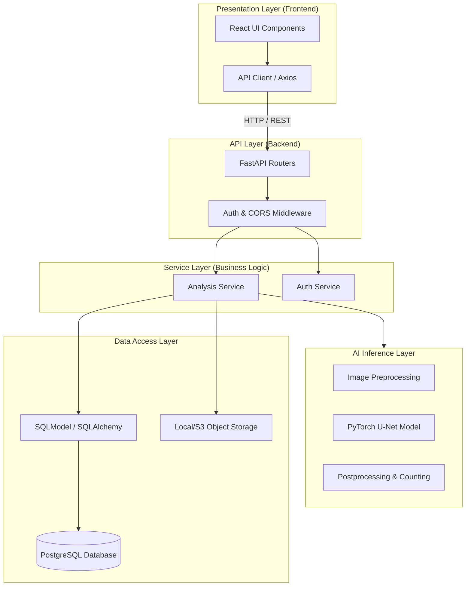
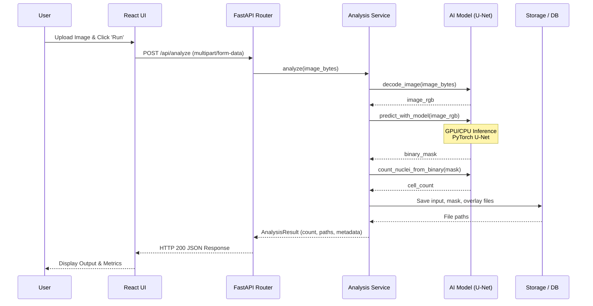

# Software Architecture Document (SAD) - Phase 1
## Deeply Analytics: AI Microscopy Platform

**Project:** Software Architecture Project - Phase 1
**Target System:** Deeply Analytics
**Architecture Style:** Layered Architecture (REST API)
**Date:** 02 May 2026

---

## Step 1: System Selection

### Target System Definition
**Deeply Analytics** is a web-first SaaS platform designed to automate the analysis of microscopy and histopathology images. It wraps a robust AI pipeline (U-Net) for nuclei segmentation, counting, and morphological measurement into an accessible, persistent web application. 

### System Purpose
Manual nuclei counting and morphological measurement are slow, prone to observer bias, and hard to reproduce. Deeply Analytics solves this by providing a deterministic AI-powered pipeline accessible via a web interface, enabling researchers to quickly obtain quantitative analytics (cell count, density, morphology) without requiring command-line tools or local GPU resources.

### Target Users
- **Researchers / Biologists:** Upload microscopy images, view segmented results, and export morphology data for studies.
- **Pathologists:** Use the density heatmaps and overlay visualizations to assist in tissue analysis.
- **System Administrators:** Manage user access, monitor system health, and configure AI inference parameters.

### System Functionalities
- **Image Upload & Preprocessing:** Accept microscopy images (PNG, JPG, TIFF) and normalize them for the AI model.
- **Nuclei Segmentation & Counting:** Run PyTorch-based U-Net inference to generate predicted masks and connected-components for nuclei counting.
- **Morphology & Density Extraction:** Calculate area, perimeter, circularity, and density heatmaps for each image.
- **Result Visualization:** Interactive React dashboard displaying the original image, mask, overlay, and statistics.
- **Data Persistence & Export:** Store analysis jobs in a PostgreSQL database and allow exporting reports (CSV, PDF).

---

## Step 2: Software Architecture Document (SAD - Version 1)

### 1. Use Case View

The Use Case View describes the system's functionality from the perspective of its end users.

#### Use Case Diagram

```mermaid
usecaseDiagram
    actor Researcher as "Researcher / Biologist"
    actor Admin as "System Administrator"

    rectangle "Deeply Analytics System" {
        usecase UC1 as "Authenticate (Login)"
        usecase UC2 as "Manage Projects"
        usecase UC3 as "Upload Microscopy Image"
        usecase UC4 as "View Analysis Results"
        usecase UC5 as "Export Data (CSV/PDF)"
        usecase UC6 as "Manage Users & Roles"
        usecase UC7 as "Monitor System Health"
    }

    Researcher --> UC1
    Researcher --> UC2
    Researcher --> UC3
    Researcher --> UC4
    Researcher --> UC5

    Admin --> UC1
    Admin --> UC6
    Admin --> UC7
    Admin --> UC4
```

#### Partial UI Code Implementation
The use cases for uploading images (UC3) and viewing results (UC4) are implemented in the React frontend.

**File:** `frontend/src/components/UploadPanel.tsx` (Excerpts)
```tsx
export default function UploadPanel({ file, busy, onFileSelected, onAnalyze }) {
  // Handles Drag & Drop image upload for UC3
  return (
    <div className="upload-zone" onDrop={handleDrop}>
      <p>{file ? file.name : "Drop a microscopy image here..."}</p>
      <button disabled={!file || busy} onClick={onAnalyze}>
        {busy ? "Analysing..." : "Run analysis"}
      </button>
    </div>
  );
}
```

**File:** `frontend/src/components/ResultViewer.tsx` (Excerpts)
```tsx
export default function ResultViewer({ result }) {
  // Renders the output visualization for UC4
  return (
    <div className="results-grid">
      
      
      
      <MetricCard label="Estimated cell count" value={result.cell_count} />
    </div>
  );
}
```

---

### 2. Logical View

The Logical View presents the structural organization of the system, mapping to the chosen **Layered Architecture** style.

#### Component Diagram (Layered Architecture)



#### Partial Backend Code Implementation
The Logical View is implemented in the FastAPI backend, routing requests to the Analysis Service.

**File:** `backend/main.py` (API Layer Excerpt)
```python
@app.post("/api/analyze", response_model=AnalysisResponse)
async def analyze(file: UploadFile = File(...)) -> AnalysisResponse:
    # Validates input and delegates to Service Layer
    if not file.content_type.startswith("image/"):
        raise HTTPException(status_code=400, detail="File must be an image.")
    payload = await file.read()
    result = analysis_service.analyze(payload, file.filename)
    return AnalysisResponse(**analysis_service.result_to_dict(result))
```

---

### 3. Process View

The Process View illustrates the dynamic behavior of the system, showing how components interact during runtime to execute a specific workflow.

#### Sequence Diagram: Image Analysis Workflow



#### Related Code Snippets
The sequence diagram above directly maps to the orchestration logic within the Service layer.

**File:** `backend/services/analysis_service.py` (Process Execution Excerpt)
```python
def analyze(image_bytes: bytes, original_filename: str) -> AnalysisResult:
    # 1. Prepare and decode input
    image_rgb = _decode_image(image_bytes)
    
    # 2. Execute AI Inference
    mask = _predict_with_model(image_rgb)
    overlay = make_overlay(image_rgb, mask)
    
    # 3. Postprocess and count
    cell_count = count_nuclei_from_binary(mask, min_area=MIN_AREA)
    
    # 4. Save artifacts to Data Layer
    job_id = uuid.uuid4().hex[:12]
    cv2.imwrite(str(RESULT_DIR / f"{job_id}_mask.png"), mask)
    cv2.imwrite(str(RESULT_DIR / f"{job_id}_overlay.png"), cv2.cvtColor(overlay, cv2.COLOR_RGB2BGR))
    
    # 5. Return structured result
    return AnalysisResult(
        job_id=job_id,
        status="ok",
        message="Analysis complete.",
        cell_count=int(cell_count),
        input_url=f"/files/{job_id}_input.png",
        mask_url=f"/files/{job_id}_mask.png",
        overlay_url=f"/files/{job_id}_overlay.png",
        metadata={"original_filename": original_filename}
    )
```
